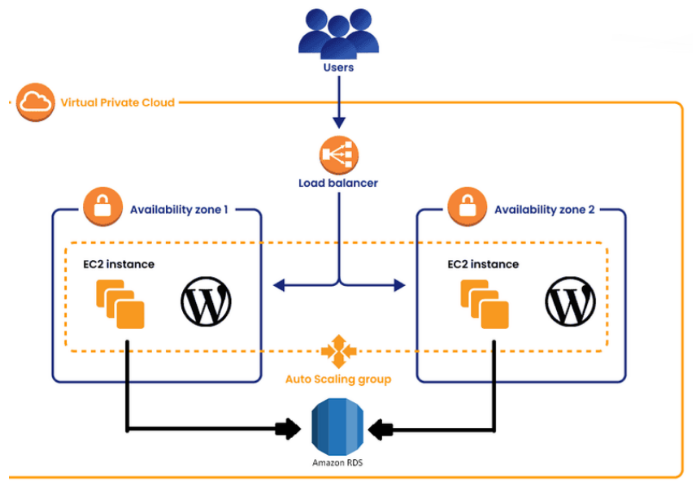
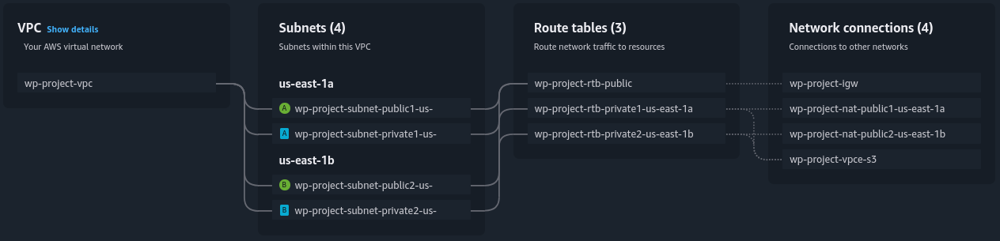
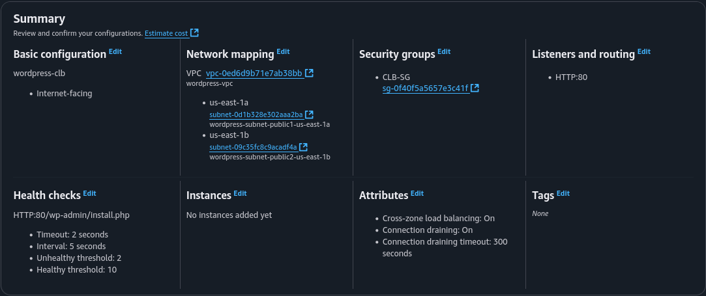
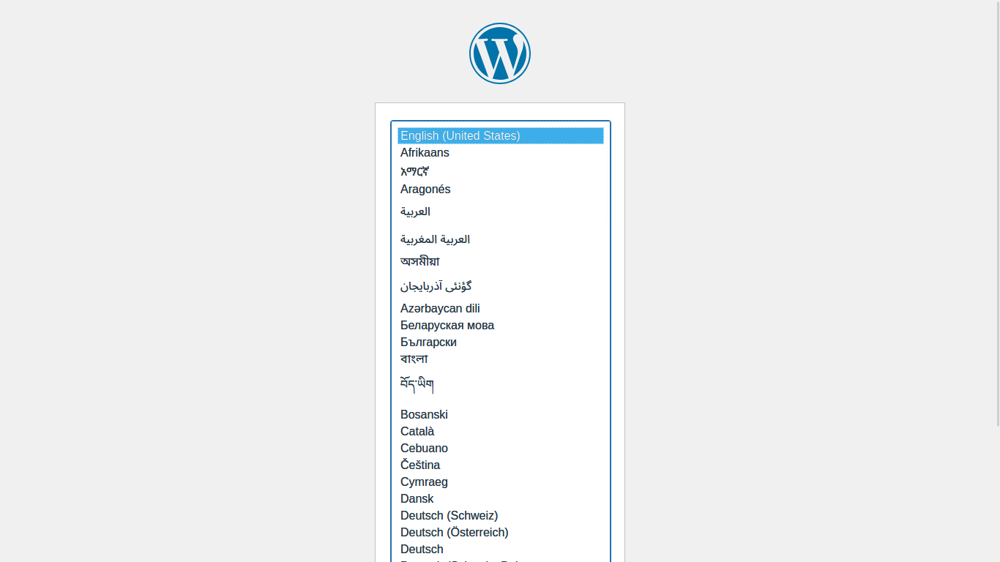

# Projeto Docker - WordPress
## Tecnologias Utilizadas
1. Docker
    * Docker Compose
2. WordPress
3. Amazon Web Services (AWS)
    * Elastic Compute Cloud (EC2)
    * Amazon Relational Database (RDS)
    * Elastic File System (EFS)
    * Classic Load Balancer (CLB)
    * Auto Scaling Group (ASG)
4. MYSQL

## Requisitos do projeto 
1. instalação e configuração do DOCKER ou CONTAINERD no host EC2;
    * Ponto adicional para o trabalho utilizar a instalação via script de Start Instance (user_data.sh)
2. Efetuar Deploy de uma aplicação Wordpress com:
    * Contêiner de aplicação;
    * RDS database MySQL.
3. configuração da utilização do serviço EFS AWS para estáticos do contêiner de aplicação WordPress.
4. configuração do serviço de Load Balancer AWS para a aplicação
WordPress

Arquitetura:



## Desenvolvimento do projeto

### VPC
Criar uma VPC em pelo menos duas AZs, uma subnet privada e uma pública em cada uma, com uma Internet, gateway para as públicas e um nat gateway para as privadas. Lembre-se também de adicionar NAT gateways para as subnets privadas.



### Security Groups
Os security Groups que serão utilizados no projeto são como descritos a seguir:

* EC2-SG
    - Regras de Entrada
        1. Acesso do Load balancer
            - Tipo: HTTP
            - Porta: 80
            - Fonte: CLB-SG
---
* RDS-SG
    - Regras de entrada
        1. Acesso das instâncias EC2
            - Tipo: MYSQL/Aurora
            - Porta: 3306
            - Fonte: EC2-SG
---
* EFS-SG
    - Regras de Entrada
        1. Acesso das instâncias EC2
            - Tipo: NFS
            - Porta: 2049
            - Fonte: EC2-SG
---
* CLB-SG
    - Regras de Entrada
        1. Acesso público
            - Tipo: HTTP
            - Porta: 80
            - Fonte: 0.0.0.0/0

### RDS
O WordPress precisa de um banco de dados para seu devido funcionamento, portanto será usado um Relational Database System da AWS. O banco de dados será um MYSQL.

* DB instance identifier: [Nome dado ao RDS]
* Master username: admin
* password: [Senha do db]

Estarei usando o free tier com uma instância do tipo t3.micro.

Lembre de anexar o security group RDS-SG criado anteriormente

**Em “Aditional Informations” nomeie o banco de dados inicial, eu nomeei como “wordpressdb” esse nome, junto do “endpoint RDS”, “Master username” e “password” serão usados depois para acessar este banco de dados.**

### EFS
Ao criar uma EFS, dê um nome e escolha a opção de customização. No segundo passo mude as subnets de montagem para as subnets privadas de cada AZ, além disso, mude o security group para o criado anteriormente para o EFS, continue avançando até criar o EFS com sucesso. Lembre de checar e anotar o DNS Name do EFS, para o próximo passo.

### User Data
O script que será usado nas instâncias. Esse script instala e configura o acesso EFS, o Docker e Docker Compose para criação do contêiner WordPress. 


```bash
#!/bin/bash

# Instalação do Docker
apt-get update -y
apt-get install -y ca-certificates curl gnupg
mkdir -p /etc/apt/keyrings

curl -fsSL https://download.docker.com/linux/ubuntu/gpg -o /etc/apt/keyrings/docker.asc
chmod a+r /etc/apt/keyrings/docker.asc

echo "deb [arch=$(dpkg --print-architecture) signed-by=/etc/apt/keyrings/docker.asc] \
https://download.docker.com/linux/ubuntu $(lsb_release -cs) stable" > /etc/apt/sources.list.d/docker.list

apt-get update -y

apt-get install -y docker-ce docker-ce-cli containerd.io docker-buildx-plugin docker-compose-plugin

sudo usermod -aG docker ubuntu
systemctl start docker
systemctl enable docker

# Montar EFS
sudo apt-get upgrade -y
sudo apt-get install -y nfs-common

sudo mkdir -p /mnt/efs
#! substituir "fs-xxxxxxxxxx.efs.us-east-1.amazonaws.com" pelo dns name do EFS
sudo mount -t nfs4 -o nfsvers=4.1,rsize=1048576,wsize=1048576,hard,timeo=600,retrans=2,noresvport fs-xxxxxxxxxx.efs.us-east-1.amazonaws.com:/ /mnt/efs

# Configuração do wordpress
sudo mkdir -p /srv/wordpress
cd /srv/wordpress

#! Substitua as variaveis anotadas entre '<' e '>'. 
cat << EOF > docker-compose.yaml
services:
  wordpress:
    image: wordpress
    restart: always
    ports:
      - 80:80
    environment:
      WORDPRESS_DB_HOST: <seu endpoint RDS>
      WORDPRESS_DB_USER: <seu usuário>
      WORDPRESS_DB_PASSWORD: <sua senha>
      WORDPRESS_DB_NAME: <nome do banco de dados>
    volumes:
      - /mnt/efs/wordpress:/var/www/html
EOF

docker compose up -d
```
### Launching Template
Estarei definindo as instâncias para usarem a AMI do Ubuntu, adicionando as devidas tags, anexando o devido security group (o que foi criado anteriormente, com nome de EC2-SG) e o userdata citado anteriormente pode ser incluído nas opções avançadas do launching template. Lembrando sempre de editar o script para adicionar as variáveis corretas.

### Classic Load Balancer
Criar um Classic Load Balancer, mapeando para as AZs. Novamente, anexando o security group criado anteriormente, CLB-SG nesse caso.

As rotas de “Listeners and routing” serão deixadas como estão, padrão http porta 80 para 80.
O caminho para o health check será definido para “/wp-admin/install.php”.


### Auto Scaling Group
Crie o nome e selecione o lauching template criado anteriormente. No próximo passo selecione as subnets privadas para usar. Também tenha certeza de definir o tipo de instância desejada.

Na etapa de Load Balancing selecione “Attach to an existing load balancer”, depois “Choose from Classic Load Balancers”. Selecione o load balancer criado no passo anterior.

Marque “Turn on Elastic Load Balancing health checks” para que as instâncias sejam devidamente reiniciadas em casos de erro.

No próximo passo, defina o tamanho do grupo, para esse projeto um grupo de tamanho desejado 2, mínimo 1 e máximo 2 é suficiente.

Continue até finalizar a criação do auto Scaling group, após isso tudo já deve estar em ordem, aguarde alguns minutos e teste acessar o WordPress através do DNS name do load balancer!

## Conclusões finais
Após tudo devidamente definido, o resultado é um site publico de WordPress, com um banco de dados relacional gerido pela AWS, com arquivos estáticos salvos num EFS!
Essa instalação é segura, escalável e resiliente.


